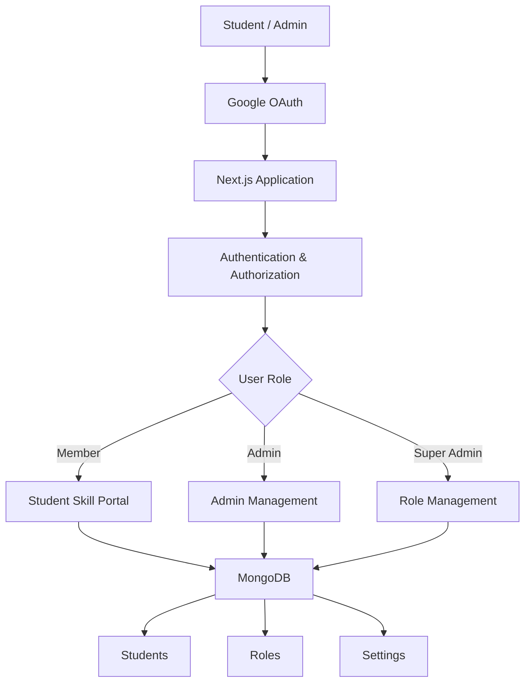

# SkillTrack — Student Skill Progress & Development Portal

> A role-based student skill management platform for tracking technical skills, activities, points, and academic development in one centralized portal.

## Overview

**SkillTrack** is a web-based Student Skill Progress Portal designed to help institutions manage and monitor student development.

The platform provides a centralized environment where students can view their skill progress, while authorized administrators can manage student records, skills, points, and access permissions.

The system combines **Google OAuth authentication, role-based authorization, MongoDB data management, and a spreadsheet-style skill tracking interface** into a single platform.

---

## Problem Statement

Student skill information is often maintained across spreadsheets, separate documents, and disconnected systems.

This makes it difficult to:

* Track individual skill development
* Maintain updated student records
* Monitor activity and reward points
* Manage administrator access
* Analyze student progress
* Maintain a centralized source of truth

## Our Solution

SkillTrack provides a centralized platform where student skill information can be securely managed and monitored.

### Core workflow

```text
Student Authentication
        ↓
Role Verification
        ↓
Student Skill Profile
        ↓
Skill & Activity Tracking
        ↓
Points / Progress Monitoring
        ↓
Administrative Management
        ↓
Centralized MongoDB Storage
```

---

## Key Features

### 🔐 Secure Authentication

* Google OAuth-based sign-in
* Institutional email restriction
* Server-side authentication
* Role-based access control

### 👥 Role-Based Access

The platform supports different levels of access:

* **Member** — Access personal student information
* **Admin** — Manage student skill information
* **Super Admin** — Manage administrative permissions

### 📊 Skill Tracking

A spreadsheet-style interface allows skill information to be organized and managed efficiently.

Examples include:

* Programming skills
* Framework knowledge
* Technical activities
* Skill completion status
* Reward points
* Activity points

### ⭐ Points Management

The portal supports tracking of:

* Reward Points
* Activity Points
* Skill-related progress

### 🛡️ Administrative Control

Super administrators can manage administrative access by:

* Granting admin privileges
* Removing admin privileges
* Managing role assignments

### 🗄️ Centralized Database

MongoDB acts as the central source of truth for:

* Student records
* Skill information
* Role assignments
* Portal settings

---

## System Architecture



---

## Application Workflow

```text
User
 ↓
Google Sign-In
 ↓
Institutional Email Validation
 ↓
Authentication
 ↓
Role Detection
 ↓
 ┌───────────────┬───────────────┬────────────────┐
 │               │               │
Member          Admin        Super Admin
 │               │               │
 ↓               ↓               ↓
Student       Student Data    Role Management
Skills        Management      & Permissions
 │               │               │
 └───────────────┴───────────────┘
                 ↓
              MongoDB
```

---

## Database Structure

SkillTrack uses MongoDB with three primary collections:

### `students`

Stores student information and skill values.

Example structure:

```json
{
  "email": "student@example.com",
  "values": {
    "Names": "Student Name",
    "Position": "Member",
    "Roll Number": "23CS001",
    "Reward Points": "10",
    "Activity Points": "4",
    "JavaScript": "Completed",
    "React": "Completed",
    "Python": "Completed"
  }
}
```

### `roles`

Stores additional administrative role assignments.

### `settings`

Stores configurable portal information such as the skill column configuration.

---

## Technology Stack

| Layer          | Technology                  |
| -------------- | --------------------------- |
| Frontend       | Next.js                     |
| UI             | React                       |
| Styling        | Tailwind CSS                |
| Language       | TypeScript                  |
| Authentication | NextAuth / Google OAuth     |
| Database       | MongoDB                     |
| Validation     | Zod                         |
| Deployment     | Vercel / Netlify compatible |

---

## Project Structure

```text
SkillTrack-Student-Portal/
│
├── src/
│   ├── app/
│   ├── components/
│   ├── lib/
│   └── ...
│
├── public/
│
├── scripts/
│   ├── bootstrap.mjs
│   └── sync-members.mjs
│
├── .env.example
├── .gitignore
├── next.config.ts
├── package.json
├── tailwind.config.ts
├── postcss.config.js
└── README.md
```

---

## Getting Started

### 1. Clone the repository

```bash
git clone https://github.com/vasanth-1208/SkillTrack-Student-Portal.git

cd SkillTrack-Student-Portal
```

### 2. Install dependencies

```bash
npm install
```

### 3. Configure environment variables

Create a local environment file:

```bash
cp .env.example .env.local
```

Configure the required:

* Google OAuth credentials
* MongoDB connection
* Database name
* Institutional email configuration
* Allowed users

**Never commit `.env.local` or real credentials to GitHub.**

### 4. Initialize the database

```bash
npm run bootstrap
```

### 5. Start the development server

```bash
npm run dev
```

Open the application at:

```text
http://localhost:3000
```

---

## Available Commands

```bash
npm run dev
```

Start the development server.

```bash
npm run build
```

Create a production build.

```bash
npm start
```

Start the production server.

```bash
npm run typecheck
```

Run TypeScript validation.

```bash
npm run bootstrap
```

Initialize the required MongoDB data.

```bash
npm run sync-members
```

Synchronize member information.

---

## Security

The application is designed with access control and environment-based configuration.

Important security practices:

* OAuth authentication
* Institutional email restrictions
* Role-based authorization
* Server-side data access
* Environment variables for credentials
* MongoDB as the centralized data source
* Input validation with Zod

### Security Note

Never expose:

```text
MongoDB connection strings
Google OAuth client secrets
API keys
Passwords
Private environment variables
```

If credentials were previously committed to Git history, rotate them before deploying the application.

---

## Future Enhancements

Planned improvements include:

* 📈 Individual student analytics dashboard
* 📊 Skill-wise progress visualization
* 🏆 Student leaderboard
* 🏅 Achievement and badge system
* 🎯 Personalized skill development goals
* 📅 Student activity timeline
* 📑 Automated progress reports
* 📥 Excel/CSV import and export
* 🔔 Notifications
* 📊 Advanced admin analytics
* 📝 Audit logs
* 📱 Enhanced mobile experience
* 🌙 Dark/light theme
* 📈 Historical skill progression

---

## Why SkillTrack?

Traditional student records mainly focus on academic information.

SkillTrack focuses on **skill development and continuous progress**.

```text
Student Data
     +
Skills
     +
Activities
     +
Points
     +
Progress
     ↓
Student Development Intelligence
```

This makes the platform suitable for institutions that want to move from static student records toward **continuous skill tracking and development management**.

---

## Project Status

**Active Development**

The current version provides the core authentication, role management, student skill tracking, MongoDB integration, and administrative functionality.

Additional analytics, visualization, reporting, and student-development features can be built on top of the existing architecture.

---

## Author

**Vasantharaj M**

B.E. Computer Science and Engineering
Bannari Amman Institute of Technology

GitHub: `vasanth-1208`

---

## License

This project is currently maintained as an educational and institutional project. No open-source license has been declared.
